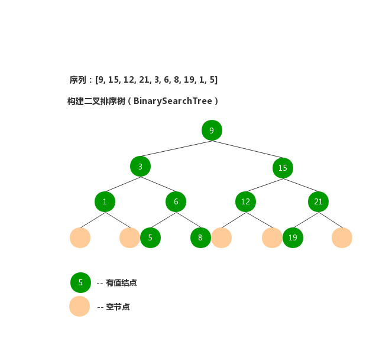
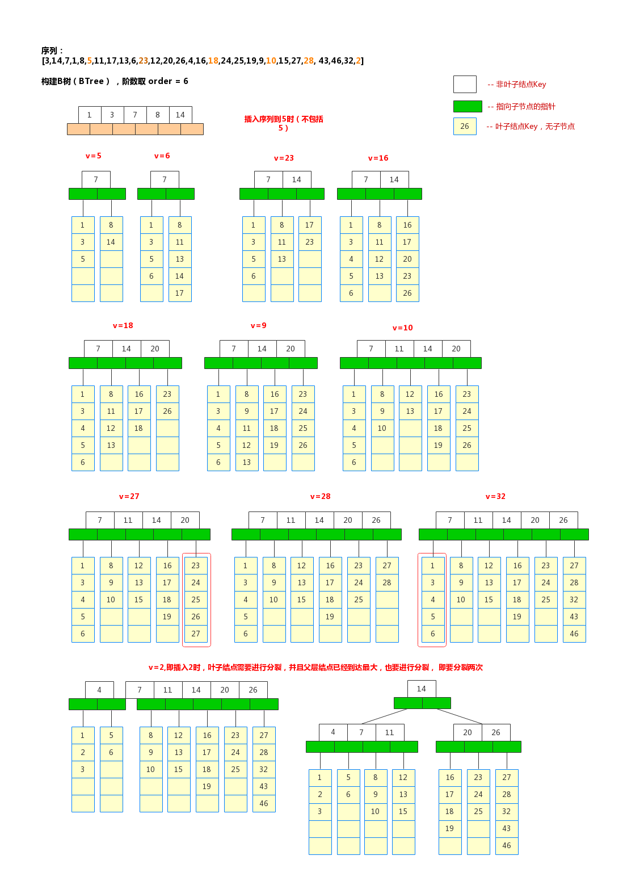
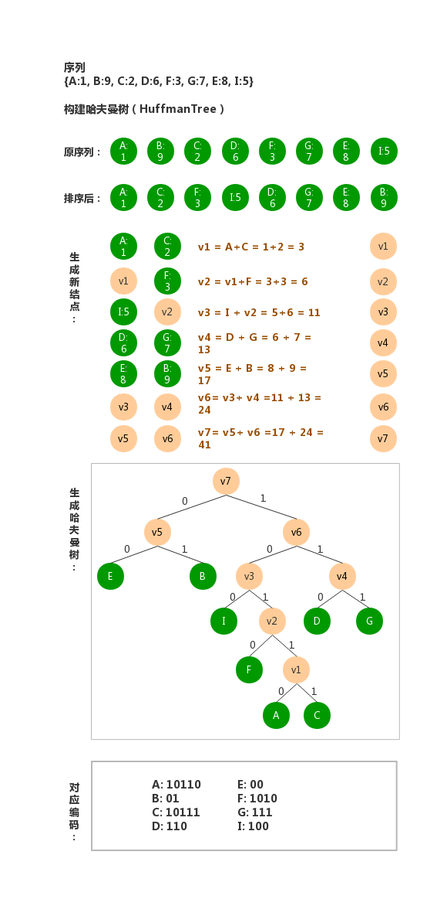

###基本概念与术语
    1、数据：
          计算机科学中指所有能输入到计算机中并被计算机程序处理的符号总称。
          
    2、数据项：
          数据项是数据不可分割的最小单位，通俗的说法就是字段，比如关系性数据库表的一个字段。
          
    3、数据元素：
          数据元素是数据的基本单位，一个数据元素由若干个数据项组成，就好比一个java对象，在关系性数据库中就是对应的一张表的一行数据。
          
    4、数据对象：
          数据对象是性质相同的数据元素的集合，比如，一个List<Person> 集合对象一样，在关系性数据库中就是对应的一张表。
          
    5、数据结构：
          数据结构是数据对象中各元素及其相互关系的集合，数据关心的就是数据元素，结构关心的就是数据元素之间的关系。
       
        逻辑结构分4类：
        ①. 集合结构   ————这种结构仅仅满足 数据元素在同一个范围类，数据元素之间无序满足任何顺序大小空间等关系。
        ②. 线性结构   ————数据元素存在一对一关系。
        ③. 层次结构   ————数据元素存在一对多关系。
        ④. 网状结构   ————数据元素存在多对多关系。
        
        物理结构：
            物理结构是非常复杂的，涉及非常的技术细节，这些已经涉及到硬件的工艺制作流程了。
            
        存储结构：
        ①. 顺序存储结构
        ②. 链式存储结构
        ③. 索引存储结构
        ⑤. 散列存储结构

###数据结构概述：
    线性关系和非线性关系
    线性表、栈、队列都是线性关系结构
    树为非线性关系结构

###线性表：
    在由n个元素构成的有穷序列，每个元素有且仅有一个直接前驱和一个直接后驱（1<i<n）,第一个元素有且仅有一个后驱，最有一个元素有且仅有一个前驱。
   
    操作：
        增加   删除  查找  修改  遍历  合并  分解  排序  求大小
   
    两种线性表：
        顺序存储结构的线性表   ————在计算机内存中是一块地址连续的物理空间
        链式存储结构的线性表   ————在计算机内存中的存储位置非连续变化的空间，通过一个指向前驱的节点与一个指向后驱的节点来物理寻址
             链表又可划分为：      单链表、 双向链表、 循环链表
        
    线性表的实现：
        java 中采用数组与Node节点内部类来分别实现两种结构的线性表，代表： ArrayList 与 LinkedList
        C、C++ 中采用数组 与 指针分别实现
              
###栈：
    栈是一种功能弱化的线性表，栈只有一个入口，满足先进后出（Last In First out, LIFO）条件：
    存取元素称之入栈（push）
    删除元素称之出栈（pop）
    对栈进行运算的一端称之为栈顶，栈顶第一个元素称为栈顶元素
    相对地，栈的另一端称之为栈底
    没有元素的栈称为空栈
   
    栈的操作：
        初始化    压栈（push）   出栈（pop）  读取栈顶元素    判断为空    遍历    栈大小
   
    栈的实现：
        java中采用数组，Node内部类实现， 代表：java.util.Stack，LinkedList也实现了栈的功能
   
    栈的应用场景：
        比较重要的就是 实现递归过程、回文等

###队列：
    队列同样是附加了某种限制条件的线性表，特殊支持在于：仅允许在表的一端进行存储，在表的另一端进行删除，满足先进先出（FIFO）条件：
    进行插入存储的一端称为队尾（rear）
    进行删除的一端称之为队首（front）
   
    队列操作：
       初始化
       加入元素      ——队尾加入
       删除元素      ——队首删除
       队列长度
       访问队列前端元素
       判断队列是否为空
       清空队列
   
    栈的实现：
        代表：Queue Deque
       
###树：
    树是一种一对多的具有层次关系的数据结构。树的相关概念：
    根节点（root）: 树的最顶层，有且仅有一个。
    节点的度：一个节点的子节点的个数称为该节点的度
    树的度：指该树中结点的最大度数
    叶子节点：树中度为0的节点
    分枝节点：树中度不为0的节点，除根节点外的分枝节点统称内部节点
    路径：存在节点序列K1,...,Kj，使得Ki是节点Ki+1的父节点（1<i<j），称该节点序列是树中从节点K1到Kj的一条路径，路径长度为j-1
    祖先与子孙：
    树的深度或层次度：从树根到任意节点有唯一的一条路径，该路径的长度为节点的深度或层次数，深度相同的节点处于同一层。
    树的高度：树中节点的最大层次数。
    森林：指m(m>0)棵树互不相交的树的集合。
    
    树的操作：
    ① 初始化一棵树
    ② Root(x): 求节点x所在树的根节点
    ③ Parent(tree,x): 求树tree中x节点的父节点
    ④ Child(tree,x,i):
    ⑤ Insert(tree,x,i,s)
    ⑥ Delete(tree,x,i)
    ⑦ Tranverse(tree) : 遍历树

###二叉树（Binary Tree, BT）
    二叉树的所有分枝节点的下层子节点的个数不超过2的树称之为二叉树。
   
###二叉树的性质
    第i层上至多有2^(i-1)个节点（i>=1）
    深度为h的二叉树至多具有2^h-1个节点
    如果叶子节点数为n0, 度为2的节点数为n2,则n0=n2+1
    具有n个节点的完全二叉树的深度为[log2n]+1，其中[log2n]+1是向下取整
  
###二叉树的遍历
    前序遍历：先访问根结点，再访问左子结点，最后访问右子节点；
    中序遍历：先访问左子结点，再访问根结点，最后访问右子节点；
    后序遍历：先访问左子结点，再访问右子节点，最后访问根结点；
    广度优先遍历：一层一层的遍历
   
###特殊二叉树
    满二叉树    完全二叉树   理想二叉树         二叉排序树
    哈弗夫曼树   平衡二叉树   红黑树   堆   B/B_/B+树

###满二叉树    
    一个高度为h且有(2^h - 1) 个节点的二叉树
 
###完成二叉树
    除最后一层外，其余层都是满的，最后一层可满可不满，不满时从右边依次缺失若干个节点

###理想二叉树
    除最后一层外，其余层都是满的，最后一层可满可不满，不满时任意位置缺失若干个节点

###三者关系
    理想二叉树包含了满二叉树和完全二叉树，完全二叉树包含了满二叉树
   
###二叉排序树（Binary Sorting Tree）
    又称二叉搜索树，具有如下特性：
    ① 如果左子树非空，则左子树所有节点的值均小于树根节点的值
    ② 如果右子树非空，则右子树所有节点的值均大于树根节点的值
    ③ 左、右子树本身又各是一棵二叉排序树
* 如图所示：

     

###B树
    一颗M阶的B树具有如下特性：
    1. 一个节点最多包含有M个子树、M-1个关键字（即数据）（M >=2）;
    2. 除根节点与叶子节点外，其他每个结点至少有ceil(M/2)个子节点，ceil为向上取整;
    3. 若根节点不是叶子节点，则至少有两颗子树;
    注：B树也是需要满足排序的性质的
* 如图所示：

###哈弗曼树（Huffman Tree）： 
    又称最优二叉树，
* 如图所示：

   

### 红黑树：
    红黑树是介于二叉搜索树，与AVL树之间的一种折中的树，避免了二叉搜索树成线性的的情况，又避免了
    AVL完全平衡带来的性能影响
    
    红黑树的特点：
    1. 根节点始终是黑色
    2. 从根到叶子的路径上不能出现相邻的两个红色节点
    3. 

### 图论：

    