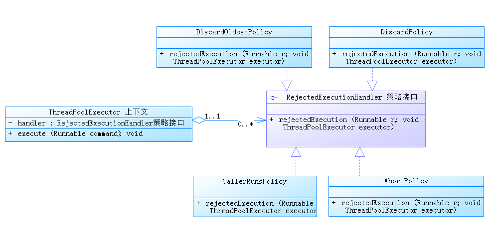

## 策略模式（strategy pattern）
定义：
    
    定义了算法族，分别封装起来，让它们之间可以相互替换，此模式让算法的变化独立于使用算法的客户。

结构：
        
    1.策略接口角色IStrategy：用来约束一系列具体的策略算法，策略上下文角色使用此策略接口来调用具体的策略所实现的算法。
    2.策略实现角色ConcreteStrategy：具体的策略实现-实现IStrategy，即具体的算法实现。
    3.策略上下文StrategyContext: 负责和具体的策略实现交互。
    
JDK中的策略模式：

    多线程中的线程池中，当没有多余的线程来执行任务，并且保存任务的队列也满了（指的是有界队列），对仍在提交给线程池的任务的会有一个处理策略，
    即RejectedExecutionHandler。  
    RejectedExecutionHandler有四个实现类：
        AbortPolicy：该策略是直接将提交的任务抛弃掉，并抛出RejectedExecutionException异常
        DiscardPolicy：该策略也是将任务抛弃掉（对于提交的任务不管不问，什么也不做），不过并不抛出异常
        DiscardOldestPolicy：该策略是当执行器未关闭时，从任务队列workQueue中取出第一个任务，并抛弃这第一个任务，进而有空间存储刚刚提交的任务。使用该策略要特别小心，因为它会直接抛弃之前的任务
        CallerRunsPolicy：该策略并没有抛弃任何的任务，由于线程池中已经没有了多余的线程来分配该任务，该策略是在当前线程（调用者线程）中直接执行该任务。        

JDK-RejectedExecutionHandler UML类图：
    

特点：
    
    策略模式体现了开闭原则：策略模式把一系列的可变算法进行封装，从而定义了良好的程序结构，在出现新的算法的时候，可以很容易的将新的算法实现加入到已有的系统中，而已有的实现不需要修改。
    策略模式体现了里氏替换原则：策略模式是一个扁平的结构，各个策略实现都是兄弟关系，实现了同一个接口或者继承了同一个抽象类。这样只要使用策略的客户端保持面向抽象编程，就可以动态的切换不同的策略实现以进行替换。